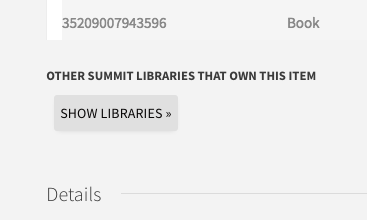

# primo-explore-toggle-institutions
[](https://www.npmjs.com/package/primo-explore-toggle-institutions)

## Features
The list of institutions that also hold an item in details view is collapsed, and a button to toggle expanding the list appears.
### Screenshot


## Install
1. Make sure you've installed and configured [primo-explore-devenv](https://github.com/ExLibrisGroup/primo-explore-devenv).
2. Navigate to your template/central package root directory. For example:
    ```
    cd primo-explore/custom/MY_VIEW_ID
    ```
3. If you do not already have a `package.json` file in this directory, create one:
    ```
    npm init -y
    ```
4. Install this package:
    ```
    npm install primo-explore-toggle-institutions
    ```

alternatively, just copy `dist/module.js` into your package's `custom.js` file.

## Usage
First, add `toggleInstitutions` as a dependency for your local view module definition.

```js
var app = angular.module('viewCustom', ['toggleInstitutions'])
```
Then, enable the customization by embedding it in the `prmAlmaMoreInstAfter` hook:
```js
app.component('prmAlmaMoreInstAfter', {template: '<toggle-institutions />'})
```
#### Configuration
The default is to initially collapse the list. If you wish to keep it open initially, you can replace the above with:
```js
app.component('prmAlmaMoreInstAfter', {template: '<toggle-institutions start-hidden=false />'})
```

<!-- ## Running tests
1. Clone the repo
2. Run `npm install`
3. Run `npm test` -->
